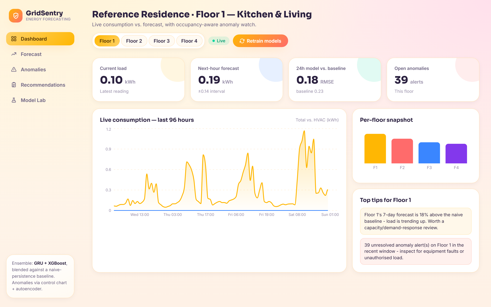
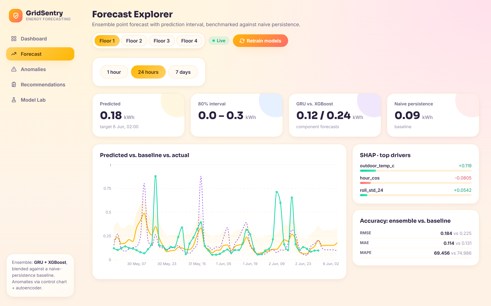
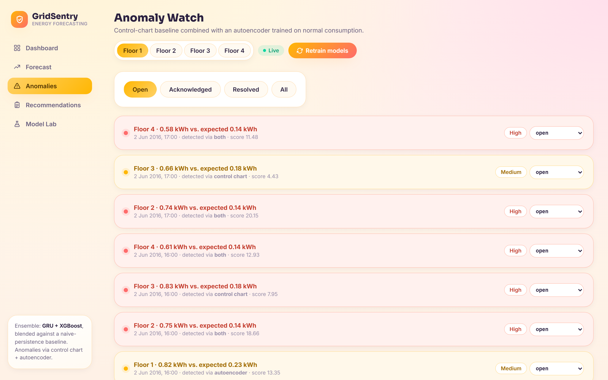
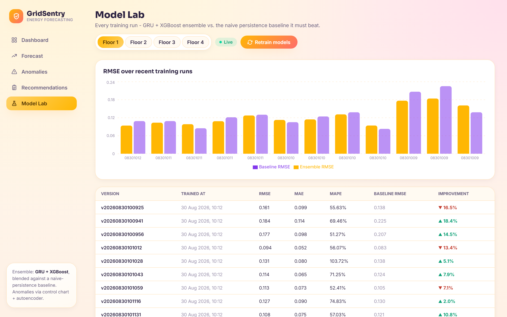
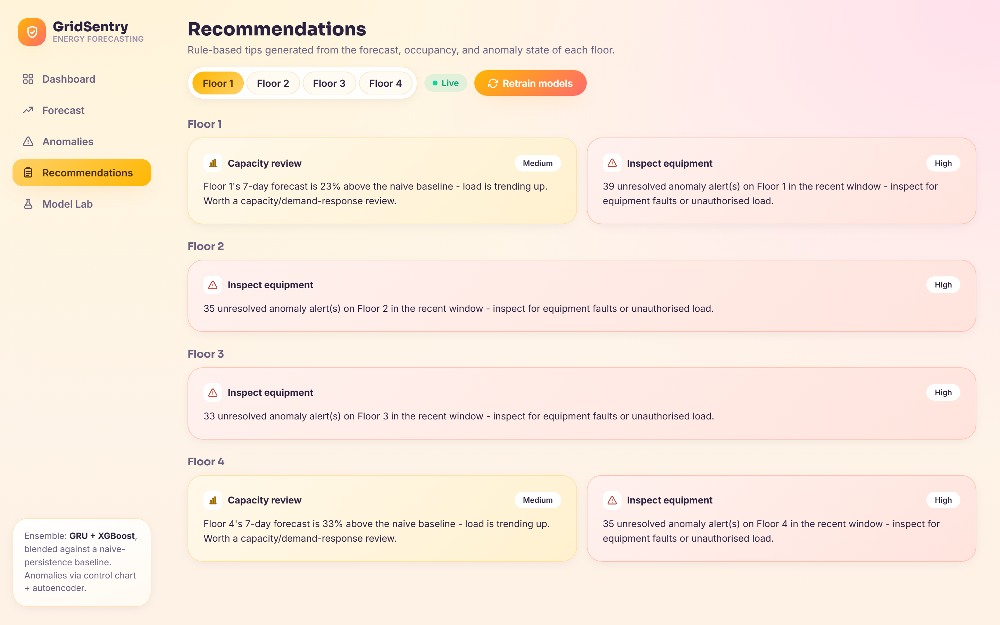

# GridSentry

**Occupancy-aware energy consumption forecasting for smart buildings** — Capstone Project(MIT-WPU).

Forecasts a building's electricity use 1 hour, 24 hours, and 7 days ahead with a GRU + XGBoost ensemble, flags anomalies with a control-chart + autoencoder, and serves it through a FastAPI backend and React dashboard.

## Screenshots

| Dashboard | Forecast Explorer |
|---|---|
|  |  |

| Anomaly Watch | Model Lab |
|---|---|
|  |  |



## Data

Runs on the real, public **[UCI Appliances Energy Prediction](https://doi.org/10.24432/C5VC8G)** dataset (a real house in Belgium, Jan–May 2016). 
The single real meter is split into 4 zones using each zone's own real room-sensor activity, so every floor traces back to genuine measurements rather than invented numbers:

| Floor | Zone |
|---|---|
| 1 | Kitchen & Living |
| 2 | Utility & Office |
| 3 | Bath & Ironing |
| 4 | Bedrooms |

`hvac_kwh`/`elevator_kwh` are `0` (this house has neither); `occupancy` is an inferred proxy, not a sensor reading. Once the real May-2016 timeline runs out, a scheduled tick keeps the dashboard live by replaying each floor's own reading from a week earlier with jitter.

## What it implements

- **Forecasting** — GRU + XGBoost ensemble, blended by validation RMSE, benchmarked against naive persistence, with SHAP explainability (`backend/app/models/`)
- **Anomaly detection** — control chart + autoencoder (`backend/app/anomaly/`)
- **Recommendations** — rule-based tips grounded in each floor's historical climatology (`backend/app/services/recommendation.py`)
- **API** — FastAPI over SQLite: `/forecast`, `/anomalies`, `/recommendations`, `/retrain`, ... (`backend/app/routers/`)
- **Scheduler** — nightly retraining, anomaly re-scans, live-ingestion tick (APScheduler, `main.py`)
- **Dashboard** — React + Recharts (`frontend/src`)

Architecture diagram: [`docs/GridSentry-Architecture.drawio`](docs/GridSentry-Architecture.drawio) ([PNG](docs/GridSentry-Architecture.png))

## Running it

```bash
# Backend
cd backend
python -m venv .venv
.venv/Scripts/pip install -r requirements.txt
.venv/Scripts/python seed.py            # downloads data + trains models (~1-2 min)
.venv/Scripts/uvicorn app.main:app --host 127.0.0.1 --port 8000

# Frontend (separate terminal)
cd frontend
npm install
npm run dev
```

Open `http://localhost:5173` — the frontend expects the API at `http://127.0.0.1:8000`.


